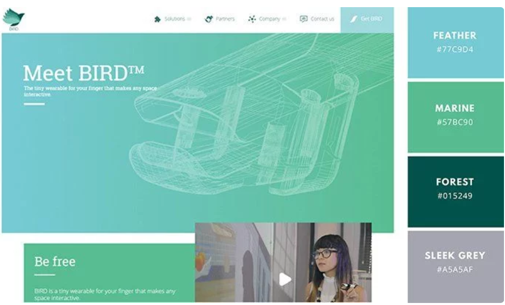
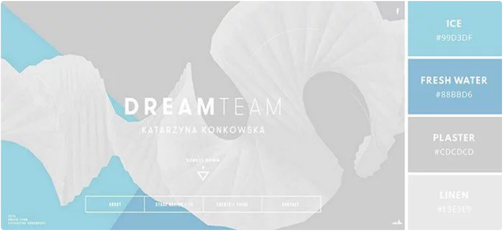
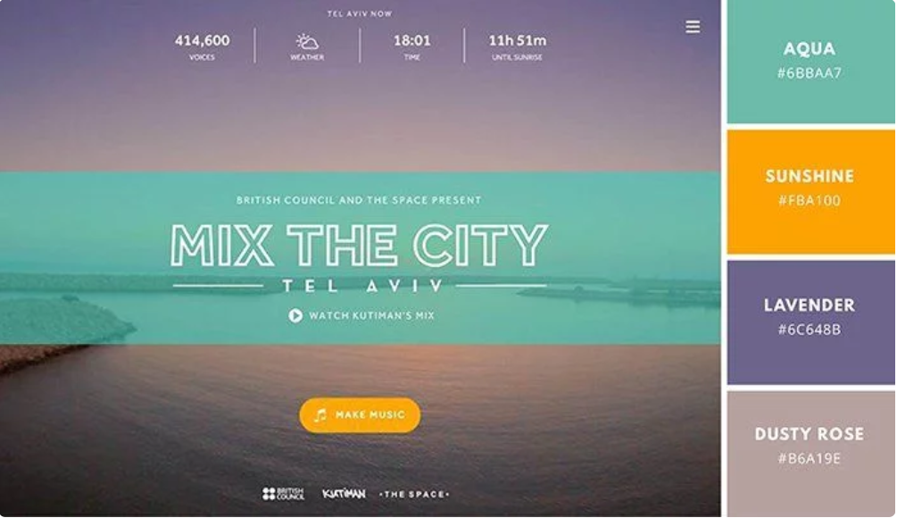
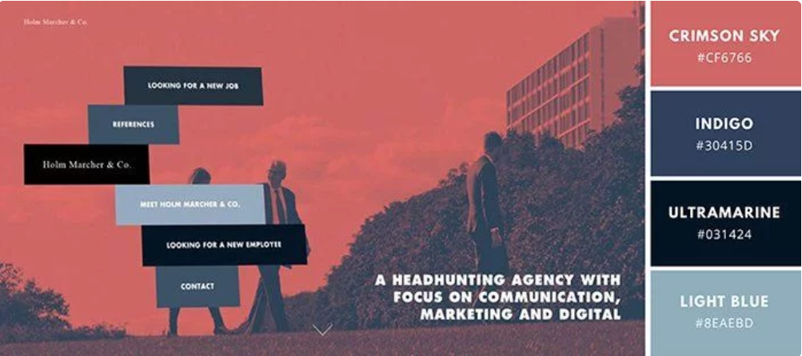

# Design Plan

The new design is inspired by a simple flowing one or two column layout. The header images and navigation are compressed into one, to create a simple navigation structure and subtle branding. The color palette is a mix of green and blue to hint at the renewable energy research. This site design was greatly inspired by [Beats by Dre](https://www.beatsbydre.com) site. One of the best features of the site is the images in the collapsible navigation, that I hope to replicate on the in this redesign.

## Color Palette

The color palette was inspired by (https://www.muvinteractive.com/)
*   Feather #77C9D4
*   Marine #57BC90
*   Forest #015249
*   Sleek Grey #A5A5AF
*   Navy Blue #18121E

## Fonts

The headers should use the whimiscal curvy font Work Sans. While the body text is a more conventional sans-serif Montserrat that is easy to read. Both of these are google fonts that can be found at (https://fonts.google.com/)
*   '''=<link href="https://fonts.googleapis.com/css?family=Work+Sans|Montserrat" rel="stylesheet">'''
*   font-family: 'Work Sans', sans-serif;
*   font-family: 'Montserrat', sans-serif;

## Design Layout

*   Compressed top navigation with submenus
*   Blocked visual and text content in middle
*   Newsletter signup on the bottom
*   Footer with social media handles and contact information

# Inspiration Board

## Meet BIRD
(https://www.muvinteractive.com/) 

## Dream Team
(http://dreamteam.pl/)

## Mix the City
(https://www.mixthecity.com)

## The North Alliance
(https://www.thenorthalliance.com/cases/transforming-how-a-headhunting-agency-attracts-talent/)

## Beats by Dre
[Beats by Dre PDF](inspired/beatsbydre.pdf) (https://www.beatsbydre.com)

<!---->

